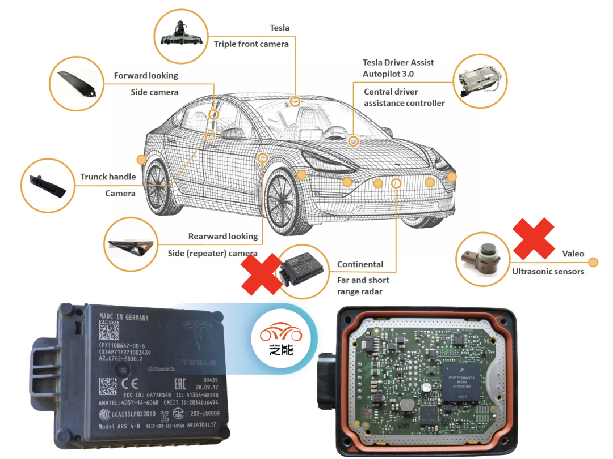

# **Week5 实验报告**
***
## **一、实验任务**
- 熟悉 FR_mid 硬件集成与物理特性
- 理解 Apollo 3.0 软件架构与源码结构

***

## **二、实现过程**

### **1. FR_mid车辆核心与紧急制动**

1. FR_mid车辆紧急制动按钮位于车辆交互屏幕下方，为一个醒目的红色按钮，直接按下可进行紧急制动，对其进行旋转即可解除紧急制动

***

2. LiDAR的工作原理及作用：

先发射数道激光束，当激光束遇到障碍物（例如行人，路障，其他车辆等）发生反射，感应器接收这种反射并记录光束从发射到返回的时间，经过公式计算即可算出激光雷达到障碍物的精确距离。当数百万个测距点聚合到一起时，形成“点云”，即为车辆实时绘制3D地图

LiDAR提供厘米级的空间位置信息与高分辨率，让车辆清晰辨识障碍物之大小和远近以及识别远处的微小障碍物（行人，自行车等）。与此同时激光雷达能在夜晚等弱光环境下工作，拥有全天候工作的能力

***

3. GNSS/IMU工作原理、作用以及协同工作

GNSS： 通过接收多颗卫星广播的时间、轨道信号，测距解算自身位置和速度

IMU： 具备陀螺仪和加速度计计算角速度和线速度加速度，基于惯性定律，可计算姿态和位置

GNSS容易受到遮挡（隧道，树林）而失效，且更新频率低难以满足高动态场景；IMU精度随时间下降。IMU与GNSS的协同可修正IMU随时间产生的误差，而IMU可解决GNSS遮挡失效的问题以及提升定位精度

***

4. 感知摄像头工作原理以及其在感知系统中的作用

工作原理： 通过镜头采取可见光成像，经过ISP处理优化画质，再输入算法做目标跟踪、检测与识别，输出车道与障碍物等关键信息

核心作用： 识别关键目标与交通要素。并且与激光雷达互补以提升感知能力

***

5. 超声波雷达的原理和作用

工作原理： 发射高频超声波，接收障碍物反射回波，通过计算声波往返时间差，换算出与障碍物的距离

核心作用： 低速泊车核心感知时，探测车身周围 0.1~5m 近距离障碍物以避免剐蹭。在恶劣条件下，不受光线、灰尘、雾霾影响，确保雨天雪天性能稳定

***

6. 毫米波雷达的原理及作用

工作原理： 发射毫米波，接收目标反射回波，通过回波的传播时间差测距、频率偏移测速、信号相位差测角，输出目标距离、速度、方位信息

核心作用： 探测 10~250m 范围目标，精准测相对速度，实现中远距离测速；不受强光、黑夜、雨雪雾影响，实现全天候稳定感知。

***

### **2. Apollo 3.0软件架构与其模块功能**

| 模块名称 | 核心功能简述 | Apollo 项目源码路径 |
| :--- | :--- | :--- |
| **感知 (Perception)** | 识别周围环境，包括障碍物检测、分类、跟踪以及红绿灯状态识别。 | `modules/perception` |
| **预测 (Prediction)** | 分析障碍物的历史运动状态，预测其未来的运动轨迹和行为意图。 | `modules/prediction` |
| **路由 (Routing)** | 负责全局路径规划，根据起点和终点计算车道级的导航路径。 | `modules/routing` |
| **规划 (Planning)** | 基于路由路径和环境约束，计算安全、平滑且可执行的局部时空轨迹。 | `modules/planning` |
| **控制 (Control)** | 将规划轨迹转换为底盘执行指令（油门、刹车、转向），纠正跟踪误差。 | `modules/control` |
| **CanBus** | 车辆底层通信接口，负责指令下发到硬件底盘及车辆状态数据的回传。 | `modules/canbus` |
| **高精地图 (HD Map)** | 提供厘米级精度的结构化地理信息，作为定位、感知和规划的参考。 | `modules/map` |
| **定位 (Localization)** | 融合多传感器数据（GNSS/IMU/LiDAR），计算车辆在全球坐标系中的精确位置。 | `modules/localization` |
| **HMI (DreamView)** | 人机交互界面，提供车辆状态可视化、模块开关控制和实时的调试视图。 | `modules/dreamview` |
| **监控 (Monitor)** | 实时扫描系统软硬件状态，确保护理器、内存及各模块运行在安全范围内。 | `modules/monitor` |
| **Guardian** | 安全防护中心，当监控模块检测到系统异常时，负责执行紧急刹车等避险动作。 | `modules/guardian` |